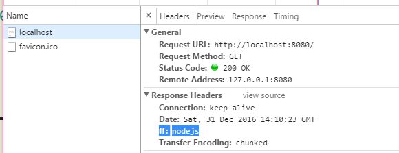

# Learn Nodejs

## 1. 基础

### 1.1 什么是nodejs

nodejs 是和 JavaScript 具有相同的语言风格，但是功能不同的两种语言，也可以说 nodejs 只是 JavaScript 的一种运行环境，(JavaScript 是一种脚本语言，而脚本语言就需要一个解析器)，当JavaScript运行在浏览器中，浏览器就是JavaScript的解析器(浏览器并不是直接解析js文件，而是通过html文件)，如果需要js文件独立运行，就需要nodejs了，这时node就是js的解析器；

每一个解析器（运行环境），允许js使用其提供的内置对象或者方法，去做一些事情，例如：浏览器（DOM操作）提供的document对象。在 nodejs 中提供的就是 fs || http 等

### 1.2 nodejs 和 JavaScript

JavaScript 只不过是 nodejs 的作者为了实现其思想，选择的一种编程语言；

相同：都是基于ECMA语法
例如在node中：
```
    var a = 100;
    console.log(a)
    // 100

    var b = new Date();
    console.log(b)
    //Mon Dec 26 2016 01:49:53 GMT+0800 (中国标准时间)

    var c = [1,2,3,4]
    c.push(5);
    console.log(c)
    // [ 1, 2, 3, 4, 5 ]

    function Person (name) {
        this.name = name
    }
    Person.prototype.say = function(){
        console.log(this.name)
    };

    var p1 = new Person('person');
    p1.say();
    // person
```

不同：
1. js中的顶层对象是window，但是node中没有window，其顶层对象是global；（在js中也存在global，但是不允许访问）
2. 在js 中，通过在通过 var 声明的变量是挂在window对象上的，但是在node中，通过var声明的对象，仅仅是在其模块作用域中（一个模块就是一个作用域）

例如：
```
var a = 100;
console.log(a) // 100
console.log(global.a) // undefined


global.a = 200;
console.log(global.a) // 200
```


### 1.3 配置nodejs

下载地址： https://nodejs.org/en/download/

建议下载.msi 的版本，提供的npm等。

配置编辑器：

1）sublime:

在sublime 中安装 nodejs插件，然后按照

http://www.cnblogs.com/qiaojie/p/5560388.html

的方式，进行修改；
如果需要使用node编译，ctrl + B,

2）WS

webStorm:
默认配置，右键运行

### 1.4 运行

1》运行 nodejs 或者 win+r 输入node
2》命令行： win+r 加 cmd 输入 node， 退出 使用两次 ctrl + c

常用命令行：
cls -- 清屏
cd -- 路径
dir -- 目录

node -v 查看版本

运行文件，通过 node 路径 就可以运行
例如：node D:\soft\wamp\www\GitHub\learnNode\1基础\html\1node.js

3》 编辑器中运行


## 2. node 模块

如果需要写大量代码，一般会将代码分到几个js文件中，在node中每一个js文件就是一个模块，文件路径就是模块名

在编写模块的时候，都有require || module || exports 单个预先定义好的变量；


### 2.1 require

使用 require 方法， 在一个模块中加载另一个模块；

`require('address')`
address --- 相对路径 || 绝对路径

>注：
相对路径：必须以 ‘./路径’ 的格式引入，如果没有 ‘./’ 就会指向node核心模块，或者去加载node目录下的 node_modules 文件夹内部的文件
绝对路劲：以/或C:之类的盘符开头

当需要查找一个文件的时候，node内部会遵循一定的方式去查找，以require('./2')为例

>1. 查找文件名称为2的文件
2. 查找2.js文件
3. 查找2.json文件
4. 查找2.node文件
5. 报错

一旦查找到文件，就直接结束查找，并返回

### 2.2 module 和 exports 模块

在node中一个模块就是一个作用域，如果模块1 想直接访问 模块2 的内容，是访问不到的；

解决方法：
1. 使用将变量挂在顶层对象 global 下。
不建议使用，会增加全局变量

2. 使用 module 模块对象 --- module是局部对象
在 module 中保存着当前模块的信息，会在require的时候，被返回；

例如：
```
console.log(module)
```

输出：
```
Module {
id: '.',
exports: {},
parent: null,
filename: 'D:\\soft\\wamp\\www\\GitHub\\learnNode\\1基础\\html\\5module.js',
loaded: false,
children: [],
paths:
[ 'D:\\soft\\wamp\\www\\GitHub\\learnNode\\1基础\\html\\node_modules',
 'D:\\soft\\wamp\\www\\GitHub\\learnNode\\1基础\\node_modules',
 'D:\\soft\\wamp\\www\\GitHub\\learnNode\\node_modules',
 'D:\\soft\\wamp\\www\\GitHub\\node_modules',
 'D:\\soft\\wamp\\www\\node_modules',
 'D:\\soft\\wamp\\node_modules',
 'D:\\soft\\node_modules',
 'D:\\node_modules' ] }
```

可以将提供给外部去访问的元素，挂在module.exports下
例如：
```
console.log(module)
var a = 100;
module.exports.a = 100;
console.log(module)
```

输出：
```
Module {
  id: '.',
  exports: { a: 100 },
  parent: null,
  filename: 'D:\\soft\\wamp\\www\\GitHub\\learnNode\\1基础\\html\\5module.js',
  loaded: false,
  children: [],
  paths:
   [ 'D:\\soft\\wamp\\www\\GitHub\\learnNode\\1基础\\html\\node_modules',
     'D:\\soft\\wamp\\www\\GitHub\\learnNode\\1基础\\node_modules',
     'D:\\soft\\wamp\\www\\GitHub\\learnNode\\node_modules',
     'D:\\soft\\wamp\\www\\GitHub\\node_modules',
     'D:\\soft\\wamp\\www\\node_modules',
     'D:\\soft\\wamp\\node_modules',
     'D:\\soft\\node_modules',
     'D:\\node_modules' ] }
```

在局部模块中还存在属性--exports
exports === module.exports

所以exports.a = 100 和 module.exports.a = 100 是相同的

注：
不建议修改 module.exports ,如果修改了module.exports 就将破坏exports和module.exports的关联，对exports一样；


### 2.3 其它

1) 模块初始化
一个模块中的JS代码仅在模块第一次被使用时执行一次，并在执行过程中初始化模块的导出对象。之后，缓存起来的导出对象被重复利用。

实例：
文件1：
```
var count1 = require('./8.1module.js')
var count2 = require('./8.1module.js')

console.log(count1()) // 2
console.log(count2()) // 3
```

文件2：
```
var i = 1;
function count () {
  i += 1;
  return i;
}

module.exports = count;
```

2)主模块

通过命令行参数传递给NodeJS以启动程序的模块被称为主模块。主模块负责调度组成整个程序的其它模块完成工作。

例如:
通过以下命令启动程序时，main.js就是主模块。
`$ node main.js`

## 3. global对象

### 3.1 `__filename` && ` __dirname`

属性：
1）`__filename` -- 表示当前编译后的绝对路径
2）`__dirname` -- 表示当前编译后的模块所在文件夹的绝对路径
3）ECMA对象

示例：

```
console.log(__filename)
// D:\soft\wamp\www\GitHub\learnNode\1基础\html\7global.js
console.log(__dirname)
// D:\soft\wamp\www\GitHub\learnNode\1基础\html
```


### 3.2 process 对象

process 对象属于global对象，通过这个对象可以返回与当前运行程序相关的信息；
可以通过`console.log(process)`来查看

属性1：argv -- 一组包含命令行参数的数组；

```
  C:\Users\dream>node D:\soft\wamp\www\GitHub\learnNode\1基础\html\process_argv.js 1
[ 'C:\\Program Files\\nodejs\\node.exe',
  'D:\\soft\\wamp\\www\\GitHub\\learnNode\\1基础\\html\\process_argv.js',
  '1' ]
```

属性2：env -- 环境信息

属性3：pid -- 信息值 // 可以在进程管理器中查看到pid

属性4：title -- 进程的名称

```
console.log(process.title)
//C:\WINDOWS\system32\cmd.exe
```

属性5：arch -- cpu 信息


方法1：cwd() 返回当前进程的目录
```
var a = process.cwd()
console.log(a)
//D:\soft\wamp\www\GitHub\learnNode\1基础\html
```

方法2：chdir(directory) -- 改变当前进程的目录

```
process.chdir('c:')
var a = process.cwd();
console.log(a)
//C:\
```

方法3：memoryUsage() -- 返回node进程占用的内存

```
var a = process.memoryUsage()
console.log(a)

// { rss: 15785984, heapTotal: 6910248, heapUsed: 2511084 }
```

方法4：exit(code)退出

方法5：kill(pid) -- 向进程发送信息

方法6：stdin & stdout 输入输出流

1）`process.stdout.write('hello')`


2）事件-- `process.stdin.on('data', function(chunk){})`
只有在输入完成后才会触发，一般认为回车是输入完成的标示，
chunk 是输入的内容

```
// process.stdout.write('hello')
// hellow
var a;
var b;

process.stdout.write('请输入a的值：');

process.stdin.on('data', function(chunk) {

    if (!a) {
        a = Number(chunk);
        process.stdout.write('请输入b的值：');
    } else {
        b = Number(chunk);

        process.stdout.write( '结果是：' + (a + b) );
    }

});
```

### 3.2 Buffer 类

用于更好的操作2进制的数据流
注：Buffer 一旦实例出来就不能修改其长度

1）new Buffer(size)

```
var a = new Buffer(4)
console.log(a) //<Buffer 00 00 00 00>
```

返回由16进制构成的长度为4的信息；

2）new Buffer(array)
```
var arr = new Buffer([1,2,3])
console.log(arr) //<Buffer 01 02 03>
```

3）new Buffer(string, [encoding])
```
var str = new Buffer('abc', 'utf-8')
console.log(str) //<Buffer 61 62 63>
console.log(str.length) //3
console.log(str[0]) //97
console.log(String.fromCharCode(str[0]))
```


注：一个中文站3个字节

```
var str1 = '哈哈哈';
console.log(str1.length); // 3
console.log(new Buffer(str1).length);//9
```

Buffer的方法：

1） write

`buf.write(要写入的字符串, 从Buffer对象中的几位开始写入, 写入的字符串的长度, 写入的字符串的编码)`

```
var str = 'abcdefg'
console.log(new Buffer(str))
var buf = new Buffer(3)

buf.write(str)
console.log(buf)
//<Buffer 61 62 63 64 65 66 67>
//<Buffer 61 62 63>
```

将str，以buf的长度重写

```
buf.write(str, 2)
console.log(buf)
// <Buffer 61 62 63 64 65 66 67>
// <Buffer a0 81 61>
```

将str在buf的第二位开始写

```

buf.write(str,1,1)
console.log(buf)
// <Buffer 61 62 63 64 65 66 67>
// <Buffer 00 61 00>
```

从buf的第一位开始写，写一位

注：如果是中文的化，会将其先转化成3个字节，在计算位置

```
var str = '哈哈哈';
console.log(new Buffer(str))
//<Buffer e5 93 88 e5 93 88 e5 93 88>

var wr = new Buffer(5)
wr.write(str, 1)
console.log(wr)
// <Buffer 66 e5 93 88 01>
```

2）toString

`buf.toString('编码格式', 起始位置, 结束位置)`

```
var str = 'abcd哈哈哈'
var buf = new Buffer(str);
console.log(buf) //<Buffer 61 62 63 64 e5 93 88 e5 93 88 e5 93 88>
console.log(buf.toString()) //abcd哈哈哈
console.log(buf.toString('utf8', '1'))//bcd哈哈哈
console.log(buf.toString('utf8', 5))//��哈哈（因为将中文的三个字节截掉了一个）
```

3）toJSON

```
var str = 'abcd'
var buf = new Buffer(str)
console.log(buf.toJSON())
//{ type: 'Buffer', data: [ 97, 98, 99, 100 ] }
```

4）slice
`buf.slice('起始位置', '结束位置')`

```
var str = 'abcdef'
var buf = new Buffer(str);
console.log(buf)//<Buffer 61 62 63 64 65 66>
var bufSon = buf.slice(1, 4)
console.log(bufSon)//<Buffer 62 63 64>
```

5)copy

`Buffer.copy(targetBuffer, [targetStart], [sourceStart], [sourceEnd]);`
相对来说并没有直接的直接拷贝副本的方法，只能新建一个长度相等的Buffer，然后在原Buffer上调用copy方法，参数中还可以设置copy的启事与结束位置等。

```
var buf = new Buffer('str');
var b = buf;
var bufSon = new Buffer(b.length)
buf.copy(bufSon)
// <Buffer 73 74 72>
console.log(bufSon)
```

buf -- 母体 bufSon -- 子体，字体要母体上copy，需要母体调用copy方法，第一个参数指定子体，而子体要指定和母体相同的长度

### 3 Buffer 方法

1）Buffer.isEncoding(encodeing)
检测Buffer是否支持encoding
//console.log( Buffer.isEncoding('utf-8') ); // true

2）Buffer.isBuffer(obj)
检测obj是否是Buffer对象
```
var arr = [1,2,3];
var bf = new Buffer(10);

console.log( Buffer.isBuffer(arr) );//false
console.log( Buffer.isBuffer(bf) );//true

```

3）Buffer.byteLength(str1,[encoding])

返回真实的字节长度，默认为utf8的格式下的长度
```
var str = 'avbd'
console.log(Buffer.byteLength(str)) //4
```

4）Buffer.concat()

```
var buf1 = new Buffer('abcd');
console.log(buf1)
// <Buffer 61 62 63 64>
var buf2 = new Buffer('cde');
console.log(buf2)
// <Buffer 63 64 65>
var buf = Buffer.concat([buf1, buf2])
console.log(buf)
// <Buffer 61 62 63 64 63 64 65>
var buf = Buffer.concat([buf1, buf2],3)
console.log(buf)
// <Buffer 61 62 63>
```

注：在node中 + 号，同样进行了隐式类型转换,实际上是调用了toString的方法

```
var buf = buf1+buf2;
console.log(buf) //abcdcde
```


## 3 FileSystem -- fs模块的底层实现方法

注：fs模块下的方法，都有同步和异步两种，参数基本相同，只是同步使用回调确保执行顺序，通过没有回调

用于处理文件或者是文件夹

1) fs.open() || fs.openSync() 打开一个文件


语法：
```
fs.open(path, flags, [mode], function(args){
  // body
})
fs.openSync(path, flags, [mode])
```

```
var fs = require('fs');
fs.open('1.txt', 'r', function(){
  console.log(arguments)
})
//{ '0': null, '1': 3 }
```
回调中第一个参数是error信息，第二个参数是fd：文件标示，也就是说3就代表这这个文件

2) fs.read() || fs.readSync() -- 读取文件

语法：
```
fs.read(fd, buffer, offset, length, position, function(args){
  // body
})
```

fd：文件标示，
buffer：buffer对象
offset：如果由A向B输出，那么offset就是在B中其实位置

```
fs.open('1.txt', 'r', function(err, fd){
  var str = new Buffer('123456789')
  console.log(str)
  fs.read(fd, str, 7, 2, 1, function(err, length, newBuf){
    console.log(arguments)
    //{ '0': null, '1': 2, '2': <Buffer 31 32 33 34 35 36 37 62 63> }
    //'1': 2, 是指要写入数据的长度
    console.log(newBuf.toString())
    //1234567bc
  })
})
```

其中1.text：abcdefg
也就是说：从str中的第7个开始链接txt文件中的第一位后面的2位后产生新的buffer

3) fs.write() || fs.writeSync()

语法：
```
fs.write(fd, buffer, offset, length, [position], function(args){
  // body
})
```


```

fs.open('./2.txt', 'r+', function(err, fd){
  var str = new Buffer('array');
  fs.write(fd, str, 1, 2, function(err, length, newBuf){
    console.log(arguments)
    // { '0': null, '1': 2, '2': <Buffer 61 72 72 61 79> }
    console.log(newBuf.toString())
    // array
  })
})

```
注：1为要写入的str的偏移值，而2是指写入长度
这种方式可以修改原文件的内用
这里的1.text： 12345678； 当write后就变成了'rr345678'

4)fs.close

```

fs.open('./2.txt', 'r+', function (err,fd) {
  fs.close(fd, function () {
    console.log('已经执行')
  })
})

```


## 4 FileSystem -- fs模块提供的方法

1) fs.writeFile() || fs.writeFileSync()

```
fs.writeFile(file, data, [options], function(args){
  // body
})
```

options 为编码格式

```
var fs = require('fs');

var str = new Buffer('1234567')
fs.writeFile('./3.txt', str, function(err){
  console.log(arguments)
  // { '0': null }
})
```

特点：能找到，就将其内容覆盖掉，没有就创建一个，将str放入

2) fs.appendFile() || fs.appendFileSync()

语法：
```
fs.appendFile(file, data, [options], function(args){
  // body
})
```

在文件内容后添加,每执行一次都会添加一次,具有和fs.writeFile相同的特点

```

fs.appendFile('./3.txt', str, function(){
  console.log(arguments)
})
```

3)fs.exists() || fs.existsSync()


语法：
```

fs.exists(path, function(args){
  // body
})
```


```
fs.exists('./4.txt', function(err){
  console.log(arguments)
  // false
})
```

```
fs.exists('./4.txt', function(err){
  console.log(arguments)
  console.log(err)
  if (!err) {
    console.log(1)
    var str = new Buffer('这是后来创建的')
    fs.writeFile('./4.txt', str, function(err){
      console.log(arguments)
    })
  }
})
```

4) fs.readFile() || fs.readFileSync()

读取文件信息

语法：
```

fs.readFile(file, [options], function(args){
  // body
})
```

```

fs.readFile('./3.txt', function(err, buf){
  console.log(arguments)

  console.log(buf.toString())
})
// { '0': null,
  // '1': <Buffer 31 32 33 34 35 36 37 31 32 33 34 35 36 37> }
// 12345671234567
```

5) fs.unlink() || fs.unlinkSync()

删除某个文件

语法：
```

fs.unlink(path, function(args){
  // body
})
```

```
fs.writeFile('./5.txt', '这里是测试unlink', function(){
  console.log(arguments)
})

fs.unlink('./5.txt', function(){
  console.log(arguments)
  console.log('文件已经删除')
})
```


6) fs.rename() || fs.renameSync()

更改文件名

```
fs.rename(oldPath, newPath, function(args){
  // body
})
```

```
fs.writeFile('6.txt', '这里是用来测试rename的', function(){

})

fs.rename('./6.txt', 'rename.txt', function(err){
  console.log(arguments)
})

```

7)fs.watch()
`// fs.watch(filename, [options], [listener])`
事件，当文件改变的时候触发，其中回调里的参数，第一个参数在修改内容的时候显示change，修改名字的时候显示rename，第二个参数表示，文件名

```
fs.writeFile('7.txt', '这里是用来测试fs.watch的', function(){

})

fs.watch('./7.txt', function (arguments) {
  console.log(arguments)
  // rename
})

fs.rename('./7.txt', './xiugaile', function(){
})

```
这个事件非常不稳定，使用前要先验证是否有效

8)fs.mkdir() || fs.mkdirSync()
创建文件夹

```
fs.mkdir(path, [mode], function(args){

  // body
})
```

```
fs.mkdir('./mkdir', function(err){
  console.log(arguments)
})
```

9) fs.rmdir() || fs.rmdirSync()

语法：
```
fs.rmdir(path, function(args){
  // body
})
```

```
fs.rmdir('./mkdir', function(err){
console.log(arguments)
})
```

10) fs.readdir() || fs.readdirSync()

读取文件夹下文件信息

```
fs.readdir(path, function(args){
  // body
})
```

function中第一个参数是err错误信息，第二个参数为fileList

```
fs.readdir('./../html/', function(){
  console.log(arguments)
})

/*
{ '0': null,
  '1':
   [ '1.txt',
     '1node.js',
     '2.txt',
     '2node.js',
     '3.txt',
     '3require.js',
     '4.txt',
     '4require.js',
  ...
     'xiugaile' ] }
 */
```

11) fs.stat()
用于查找文件和文件夹的类型

其中文件夹为16822 而 文件为 33206

```
fs.stat(e, function (err, infor) {
  console.log(e)
  console.log(infor.mode)
})
```

e代表文件夹或者是文件
其中第二个参数存有e的详细信息，其中存在一个mode，当文件夹时mode为16822 而 文件mode为 33206

```

fs.readdir('./../html/', function(err, list){
  list.forEach(function (e, i) {
    fs.stat(e, function (err, infor) {
    /*  console.log(e)
      console.log(infor)*/
      console.log(infor.mode)
      switch(infor.mode) {
        case 33206:
          console.log('[文件]'+ e);
        break;
        default:
          console.log(1)
      }
    })
  })
})
```


## 5 NodeJs Web 开发：

注：如果要在浏览器上查看效果，必须要运行nodeJS；

### 5.1 简介：

当用户浏览网页的时候，都经历了以下的过程：

1. 由用户发送HTTP请求；
2. 主机接受请求，并对用户的请求进行分析；然后相应的命令或者内容返回到用户的机器；
3. 由用户的机器接受主机返回的内容，然后执行相应操作，最后显示到界面上；


总的来说，上网的过程就是客户端与服务端之间的通讯


### 5.2 NodeJs 中的HTTP模块

NodeJs 适用于在服务端处理用户发送的数据；

首先要了解HTTP模块：

#### 5.2.1 加载http模块

`var http = require ('http')`

#### 5.2.2 创建web服务器对象

`var server = http.createServer()`

接受一个回调函数，当 客户端发送请求的时候触发，相当于server.on('request', fn) 的时候触发；

#### 5.2.3 server对象功能： 

<a href="html2/dome1.js">demo1</a>

1. 监听
`server.listen([port], [hostname], [backlog], [callback])`

port -- 监听的端口，如果不写会自动分配，其中1-1024 一般都是已经被使用了，所以写入的时候一帮要往大了写；
hostname -- 主机名(IP/域名)，如果不传，默认监听所有网卡的传输数据；
backlog -- 链接等待队列的最大长度

注：
  1. 一个端口只能被一个程序箭筒，但是一个程序可以监听多个端口；
  2. 只有调用了`server.listen()` 服务器才能接受命令

2. server.address()
`返回：{ address: '::', family: 'IPv6', port: 54115 }`

如果使用的端口已经被占用了，就会返回 error
```
events.js:160
      throw er; // Unhandled 'error' event
      ^
```

3. 错误处理

`server.on('error', function(ev){})`

注： 这里的ev存放这错误信息

4. 成功处理

`server.on('listening', function () {})`

5. 发生请求

`server.on('request', function  () {})`

这是监控用户发送的行为，如果用户发送了请求，在服务端返回数据或者命令前，客户端就会不断发送请求，直到接受请求或者请求延时的时间结束；
在createServer中

在 request 事件的函数中，存在两个参数

例如：
```
server.on('request', function  (req, res) {
  console.log(req)
})
```

req -- 接受客户端的信息，是HTTP对象的实例；
其中常用的属性有：
. httpVersion -- 协议版本
. headers -- 客户端发来的头信息，是一个对象
. url -- 路径
. method -- 请求方式 get || post

res -- 向客户端反馈信息，就由这个参数完成

其中常用的方法有：
. res.setTimeout(num) -- 设置延迟时间，默认2分钟，如果请求的时间超出延时时间，就告诉客户端不用在请求了

. res.write('') -- 写入数据，只接受字符串格式的内容，这里面的会传输给客户端，这里面如果是标签格式的，将会被浏览器解析；

. res.end() -- 所有写入已经执行结束的标示，当执行到这里的时候，就将write传输给客户端；
可以接受一个字符串参数，这个参数会调用 write；

```
  res.write('<h1>哈哈哈哈</h1>');
  res.end('<h2>呜呜呜呜</h2>')
```


. res.setHeader() -- 设置返回的 __自定义__ 头信息

注：
1. 要将setHeader() 写在 write() 前，不然会报错
2. 格式：`res.setHeader(key, value)`
可以在netWork 中查看：


. res.writeHead(状态码，[详情]，{头信息})
其中头信息包括content.type属性，用于设置浏览器对write的解析方式；
例如：
`{'content-type : text/html; charset:utf-8'}`

注：
1. writeHead 必须写在setHead 后面，end前面


#### 5.2.5 URL 处理（路由）

由于在url常常这种形式：
`http://localhost:8080/a/b/a.html` 指向根目录下的路径，如果不做处理的话就会返回一样的数据；

1. url 模块

1) 请求模块
`var ul = require('ul')`

2) 得到包含路径url信息的对象

url.parse(req.url)

返回的是：
`Url {protocol: null,slashes: null,auth: null,host: null,port: null,hostname: null,hash: null,search: null,query: null,pathname: '/a/b/a.html',path: '/a/b/a.html',href: '/a/b/a.html' }`

search：? 以后的 我们称作查询字符串
query： ? 以后不包括 ?
path 和 href 都是 域名后面所有

我们选取其中的pathname

然后根据路径执行相应的行为

```

  res.setHeader('ff', 'nodejs');
  res.writeHead(200, 'nodejs', {
    'content-type': 'text/html; charset=utf-8'
  });
  
  var urls = url.parse(req.url).pathname;

  switch (urls) {
    case '/':
      res.write('这里是首页');
      break;
    case '/user':
      res.write('这里是用户界面');
      break;
    default:
            res.write('<h1>页面被LEO吃掉了</h1>');
      break;
  }

  res.setTimeout(10000);
  res.end()
})

server.listen(8080, 'localhost');
```

3) 拆分

请求的方式有两种：1. get 2. post

get 方式
传输的信息直接存在url中

post 方式
传输的信息， 首先存放在缓存中，读取到时候还需要使用
`req.on('data', function(){})` -- 当发生请求的时候触发
`req.on('end', function(){})` -- 当传输完成的时候触发

要注意的是 无论是post方法还是get方法，返回的都是字符串，需要将其转成对象格式才能使用；
这是就需要引入新的模块 -- querystring;

请求： var querystring = require('querystring');

转化主要使用 
querystring.parse(str, [sep], [eq])
querystring.stringify(obj, [sep], [eq])


实例：  <a href="html2/dome3.js">dome3</a>

```
var http = require('http');
var url = require('url');
var fs = require('fs');
var querystring = require('querystring');

var server = http.createServer();
var HtmlDir = __dirname + '/log/';

server.on('error', function () {
  console.log('error');
})

server.on('listening', function () {
  console.log('listening')
});

server.on('request', function (req, res) {

  var urlStr = url.parse(req.url);

  switch (urlStr.pathname) {
    case '/':
      sendData( HtmlDir+'index.html', req, res )
      break;
    case '/user':
            //用户首页
            sendData( HtmlDir + 'user.html', req, res );
            break;

    case '/login':
        //用户登录
        sendData( HtmlDir + 'login.html', req, res );
        break;

   case '/login/check':
      //console.log(req.method);
      console.log(urlStr);
      console.log( querystring.parse(urlStr.query) );

      if (req.method.toUpperCase() == 'POST') {

          var str = '';

          req.on('data', function(chunk) {
              str += chunk;
          })

          req.on('end', function() {
              console.log(str);
              // username=12&password=12
              console.log( querystring.parse( str ) );
              // { username: '12', password: '12' }
          })


          res.end();

      }

      break;

    default:
       sendData( HtmlDir + 'err.html', req, res );
      break;
  }

})


function sendData (path, req, res) {
  console.log(path)
  fs.readFile(path, function (err, data) {
    if (err) {
      res.writeHead(404, {
        'content-type': 'text/html; charset=utf-8'
      });
      res.end('<h1>页面被吃了</h1>')
    } else {
      res.writeHead(200, {
        'content-type': 'text/html; charset = utf-8'
      })
      res.end(data)
    }
  })
}

server.listen(8080, 'localhost')
```


