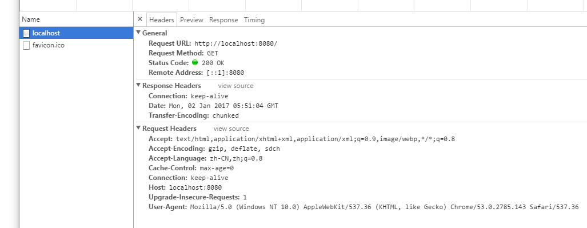
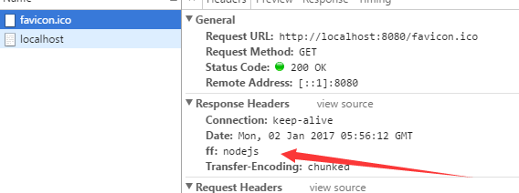

# Http 模块

## 4 NodeJs 的 Web 开发

>注： 如果需要在页面中测试，首先需要运行NodeJs 文件，仅仅是保存是看不到效果的

### 4.1 简介

一般来说，当用户浏览一个页面的时候，往往经历以下几个过程

1. 由用户发送http请求
2. 服务器接受到用户发送过来的请求，并对其分析处理，然后将处理的结果反应到用户机器上；
3. 用户端接收到服务端的处理结果，然后通过分析处理，将结果显示给用户

总的来说用户浏览网页的行为就是客户端和服务端之间的通信过程，而NodeJs就是在服务端处理用户发送的请求

## 4.2 Http 模块

NodeJs 中的 http 模块，是 NodeJs 核心模块中用于处理用户请求的；

加载 http 模块：
`var http = require('http')`

## 4.3 创建 web 服务器对象

http 下具有 createServer 方法，用于创建 web 服务器对象，用于处理请求；
语法：
`http.createServer([listener:fn(request, require)])`
>listener -- 是一个事件监听函数，当用户发出请求的时候触发；相当于 server.on('request',fn);具体参数见 request 事件

`var server = http.createServer()`

## 4.4 server 对象

[DOME1]('././httpHtml/dome1.js');

### 4.4.1 监听 -- server.listen()

用于设置用于监听的基本参数, 开启监听
语法：
`server.listen(port[, hostname][, backlog][, callback])`

- post -- 监听的端口，如果不写，会自动分配，一般 1-1024 已经被占用，所以要在写入的时候往大了写；
- hostname -- 主机名（IP/域名），如果不传，就会监听所有的网卡的传输数据
- backlog -- 链接等待队列的最大长度

注：
 一个端口只能被一个程序监听，但是一个程序可以监听多个端口
 如果忽略了hostname，那么服务器将会接受所有IPV4地址的链接，IPv4地址包括127.0.0.1 localhost和本地IP。没有认真看API，以后要注意。那么这样做就可以实现监听本地IP、localhost、127.0.0.1了：
 参考地址https://my.oschina.net/tearlight/blog/195543
 以 server.listen(8080)为例，访问 http://localhost:8080/

### 4.4.2 server.address()

server 对象下有个属性--address 用于存放监听的相关的地址信息
写在server.listen() 下

```js
var http = require('http');

var server = http.createServer(function () {
    console.log(1)
})

console.log(server)
server.listen();
console.log(server.address())

// { address: '::', family: 'IPv6', port: 49152 }
```

其中的 port 自动分配的
如果使用的端口已经被占用了，就会返回 error

```js
events.js:160
      throw er; // Unhandled 'error' event
      ^
```

### 4.4.3 错误处理

`server.on('error', function(ev){})`

注： 这里的ev存放这错误信息

### 4.4.4 成功处理

`server.on('listening', function () {})`

### 4.4.5 发生请求

`server.on('request', function  () {})`

这是监控用户发送的行为，如果用户发送了请求，在服务端返回数据或者命令前，客户端就会不断发送请求，直到接受请求或者请求延时的时间结束；
在 request 事件的函数中，存在两个参数
例如：

```js
server.on('request', function  (req, res) {
  console.log(req)
})
```

1. req -- 接受客户端的信息，是HTTP对象的实例；

    

	其中常用的属性有：

	1. httpVersion -- 协议版本
	2. headers -- 客户端发来的头信息，是一个对象
	3. url -- 路径
	4. method -- 请求方式 get || post

2. res -- 向客户端反馈信息，就由这个参数完成

	其中常用的方法有：
	1. res.setTimeout(num) -- 设置延迟时间，默认2分钟，如果请求的时间超出延时时间，就告诉客户端不用在请求了
	2. res.write('') -- 写入数据，只接受字符串格式的内容，这里面的会传输给客户端，这里面如果是标签格式的，将会被浏览器解析；
	3. res.end() -- 所有写入已经执行结束的标示，当执行到这里的时候，就将write传输给客户端；
	可以接受一个字符串参数，这个参数会调用 write；

	```js
	res.write('<h1>哈哈哈哈</h1>');
	res.end('<h2>呜呜呜呜</h2>')
	```

4. res.setHeader() -- 设置返回的 __自定义__ 头信息

格式：`res.setHeader(key, value)`



> 注：
要将setHeader() 写在 write() 前，不然会报错
可以在netWork 中查看：

5. res.writeHead(状态码，[详情]，{头信息})

其中头信息包括content.type属性，用于设置浏览器对write的解析方式；
例如：`{'content-type : text/html; charset:utf-8'}`
以下面为例：

```js
res.writeHead(200[, node][, {
    'content-type':'text/html; charset=utf8'
    }])
```

显示：


注：

1. writeHead 必须写在setHead 后面，end前面
2. 头信息中charset:utf-8 规定了对文字的编码方式

## 4.5 URL 路由

在用户访问的时候，有时不会访问根目录，而是选择根目录下的子文件夹。例如：
`http://localhost:8080/file`
如果直接访问的话，就会直接访问到根目录

### 4.5.1 URL 模块

处理路径的模块

`var url = require('url')`

```js
var url = require('url');
console.log(url)
// { parse: [Function: urlParse],
//   resolve: [Function: urlResolve],
//   resolveObject: [Function: urlResolveObject],
//   format: [Function: urlFormat],
//   Url: [Function: Url] }
```

### 4.5.2 url.parse()

`url.parse(url[, querystring:bloo][,slashes: bloo])`
----- 用于将url转成一个url对象

```
server.on('request', function (req, res) {
    console.log(req.url);// /favicon.ico
    console.log(url.parse(req.url));
    // Url {protocol: null,slashes: null,auth: null,host: null,port: null,
    // 	hostname: null,hash: null,search: null,query: null,pathname: '/favicon.ico',path: '/favicon.ico',href: '/favicon.ico' }
    res.end()
})
```
其中：
search：? 以后的 我们称作查询字符串
query： ? 以后不包括 ?
path 和 href 都是 域名后面所有

我们选取其中的pathname
然后根据路径执行相应的行为

```
server.on('request', function (req, res) {
	res.setHeader('ff','nodejs');
	res.writeHead(200, 'nodejs', {
		'content-type': 'text/html; charset=utf8'
	})
	var urls = url.parse(req.url).pathname;
	console.log(urls)// /favicon.ico

	switch (urls) {
		case '/':
			res.write('这里是首页')
			break;
		case '/user':
			res.write('这里是user页')
			break;
		case '/user/file':
			res.write('这里是user页下的file')
			break;
		default:
			// statements_def
			break;
	}
}
```

### 4.5.3 url 处理请求 与 querystring 模块

页面中的请求 分为两种 一个 get || post

1) get 方式
传输的信息直接存在url中；

2) post 方式
传输的信息， 首先存放在缓存中，读取到时候还需要使用
`req.on('data', function(){})` -- 当发生请求的时候触发
`req.on('end', function(){})` -- 当传输完成的时候触发

要注意的是 无论是post方法还是get方法，返回的都是一个Buffer对象，需要将其转成指定格式格式才能使用；
这是就需要引入新的模块 -- querystring;

请求： var querystring = require('querystring');

转化主要使用
querystring.parse(str, [sep], [eq])
querystring.stringify(obj, [sep], [eq])

```
req.on('data', function (chuck) {
    console.log(chuck);
    // <Buffer 75 73 65 72 3d 31 31 26 61 67 65 3d 31 32>
    str += chuck;
})
req.on('end', function (chuck) {
    console.log(querystring.parse(str))
    // { user: '11', age: '12' }
})
/*req.on('data', function () {
    console.log(arguments[0].toString())
    // { user: '11', age: '12' }
})*/
```

一个实例：
[example](././httpHtml/webExample/index.html)

```
var http = require('http');
var url = require('url');
var fs = require('fs');
var querystring = require('querystring');

var server = http.createServer();
var mainDir = __dirname + '/webExample/';

server.on('error', function () {
	console.log('error');
})

server.on('listening', function () {
	console.log('listening')
});

server.on('request', function (req, res) {
	res.setHeader('ff', 'nodejs')
	var urlStr = url.parse(req.url).pathname;
	var path = '';
	var data;
	switch (urlStr) {
		case '/':
			path = mainDir + 'index.html';
			break;
		case '/user':
			path = mainDir + 'user.html';
			break;
		case '/urser':
			path = mainDir + 'urser.html';
			var str = '';
			req.on('data', function (chuck) {
				console.log(chuck);
				// <Buffer 75 73 65 72 3d 31 31 26 61 67 65 3d 31 32>
				str += chuck;
			})
			req.on('end', function (chuck) {
				console.log(querystring.parse(str))
				// { user: '11', age: '12' }
			})
			/*req.on('data', function () {
				console.log(arguments[0].toString())
                // { user: '11', age: '12' }
			})*/
		default:
			// statements_def
			break;
	}
	getData(path, req, res)
	res.setTimeout(10000)
})

function getData (path, req, res) {
	console.log(path)
	fs.readFile(path, function (err, data) {
		if (err) {
			res.writeHead(404, {
				'content-type': 'text/html; charset=utf-8'
			});
			res.end('<h1>页面被吃了</h1>')
		} else {
			res.writeHead(200, {
				'content-type': 'text/html; charset = utf-8'
			})
			res.end(data)
		}
	})
}
server.listen(8080)

```


m
